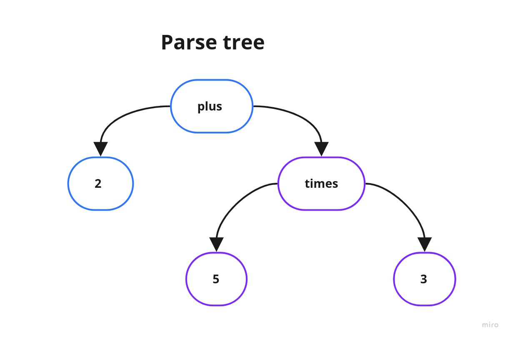

# java-calculator
A calculator (console application) built with Java

## Description
This application allows the user to input verbal math expressions and gets the results using Syntax Tree.

**Available operators:**
- plus
- minus
- times
- divided

**Samples:**

|                     Input                   | Result |
|:-------------------------------------------:|:------:|
|               1 plus 3 minus 4              |   0    |
|               (1 plus 3) times 4            |   16   |
|           2 plus (5 plus (2 times 7))       |   21   |
|               1 plus 1                      |   2    |
|               1000 minus 1                  |   999  |
|          2 plus 1 minus 5 divided 2 minus 1 |  -0.5  |
|               4 times 4                     |   16   |
|               20 divided 5                  |   4    |
|               0.5 times 10                  |   5    |

**Please, check the [Implementation](#implementation) section for more details.**


## Requirements

### For local usage:

- Java 15.0.1-zulu

## Running

Be sure to install the [requirements](#requirements).
If using [sdkman](https://sdkman.io), you can easily run:
  ```bash
  sdk install java 15.0.1-zulu
  ```
Now, open your favorite _IDE_ to open this project and use the "Run" button.

I recommend [IntelliJ IDEA](https://www.jetbrains.com/idea), but fell free to use other _IDE_.


Here is how it can be used:


## Implementation

This application uses stdin and stdout as an entry point for the system (just because this way is more simple than implementing a REST API).

**How does it work?**

Let's considerate this expression:
```bash
2 plus 5 times 3
```

1) Given the expression;
2) Convert the original expression into a list of tokens:

3) Parse the tokens, respecting the order of the operators (precedence), to calculate the final result.
- It's required to follow the math concept of BODMAS. [Here is an article about BODMAS](https://www.mathsisfun.com/operation-order-bodmas.html). In resume:
  - Do things in Parentheses First
  - Multiply or Divide before you Add or Subtract
  - Otherwise just go left to right